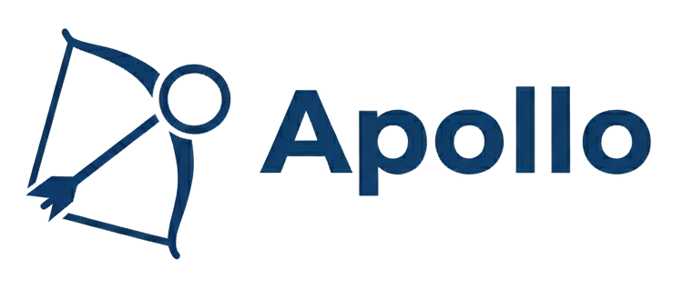
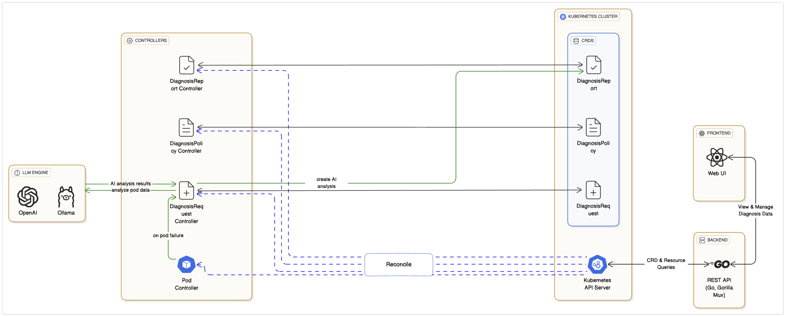
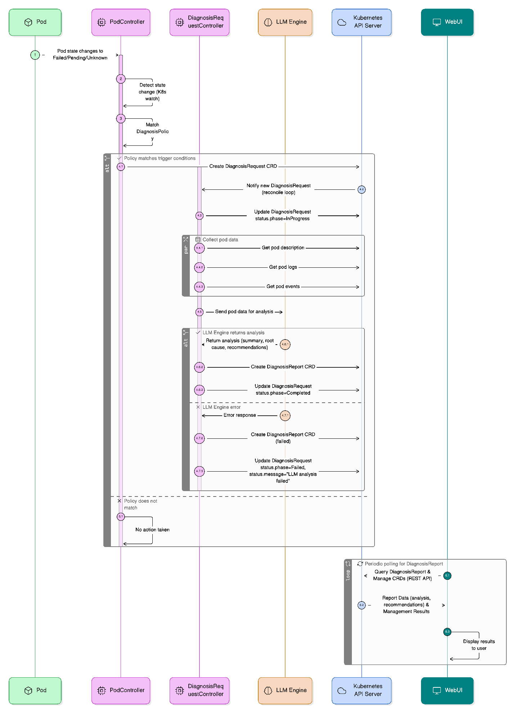
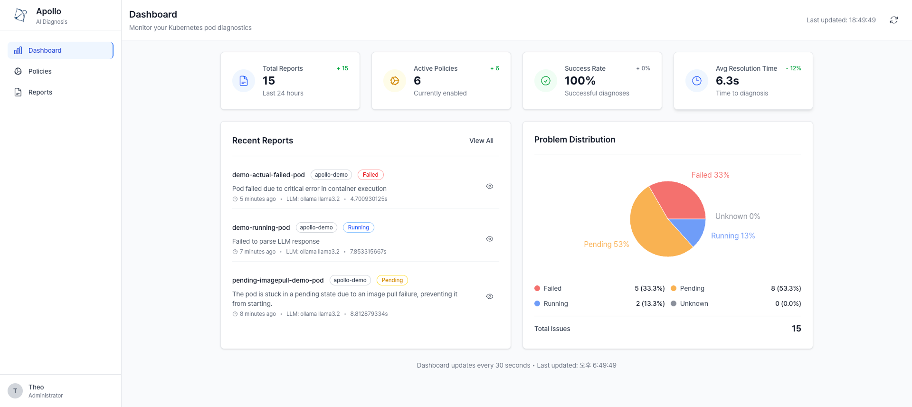
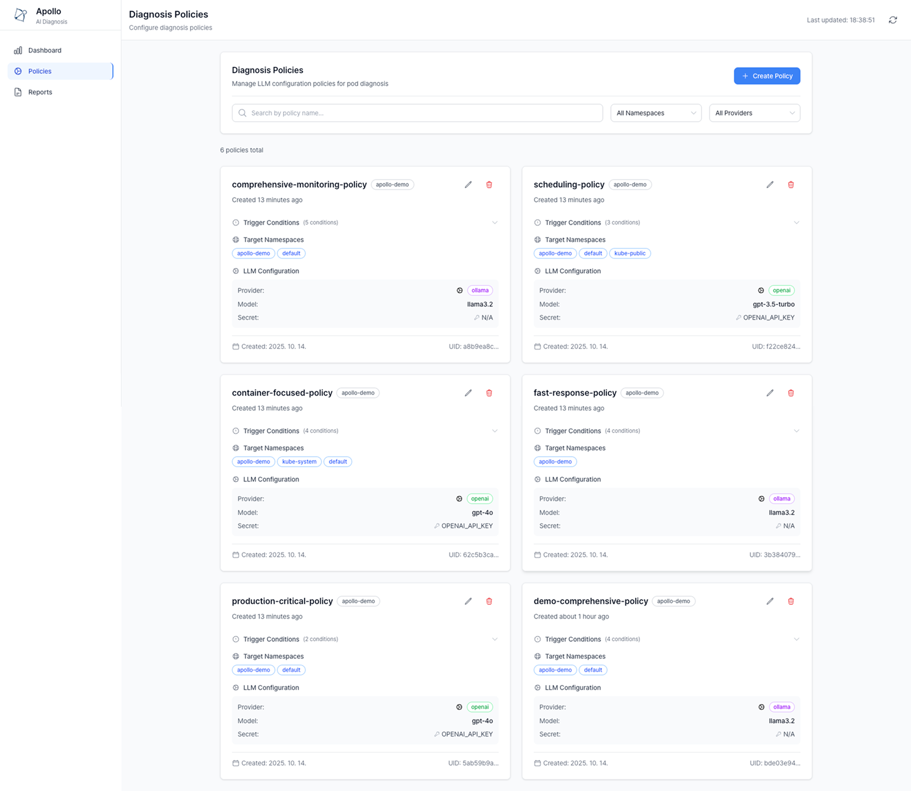
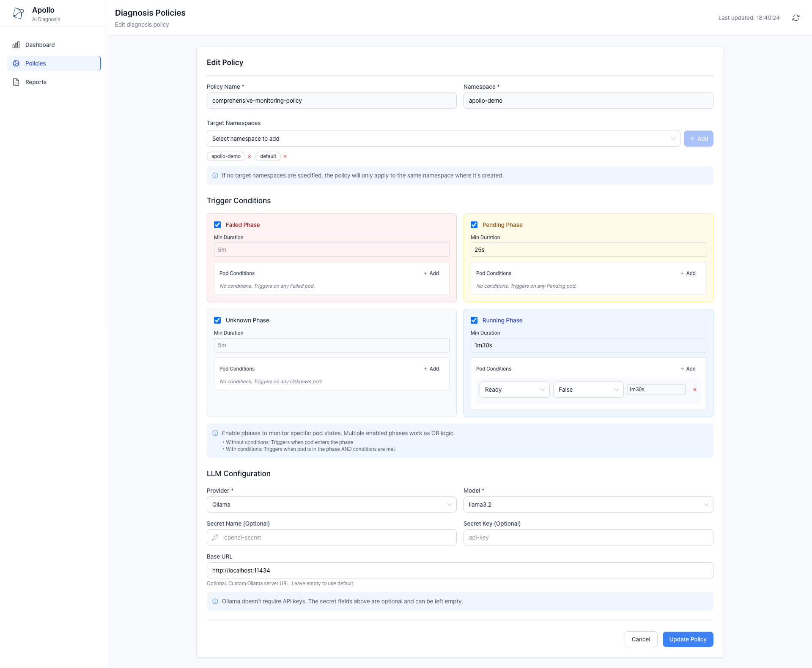
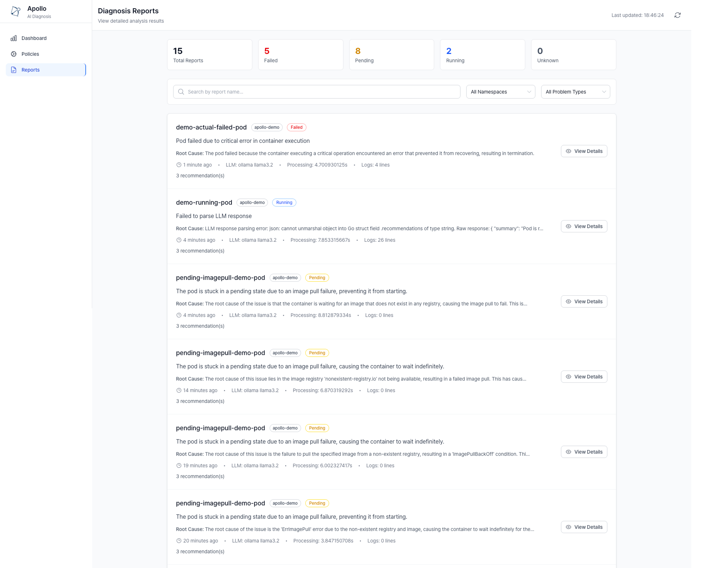
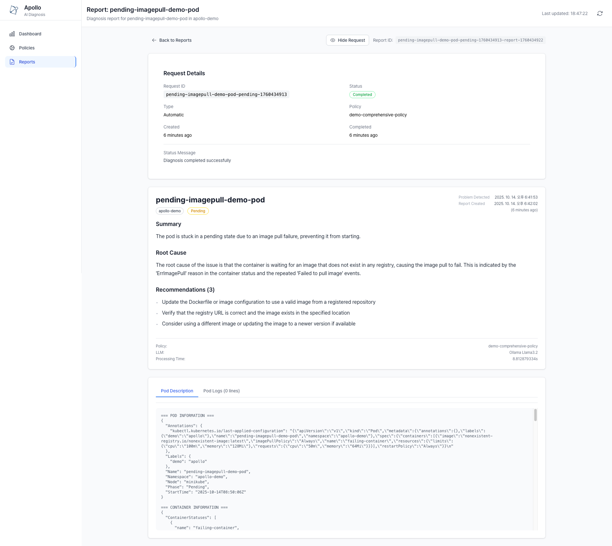

<h1 align="center">
  <picture>
    
  </picture>
  <br/>
  AI-Powered Kubernetes Pod Diagnosis Operator
</h1>

<div align="center">

[](https://goreportcard.com/report/github.com/yth01/apollo)
[](https://github.com/yth01/apollo/releases)
[](LICENSE)

</div>

Apollo is an AI-powered Kubernetes pod diagnosis operator that automatically detects failing pods and leverages AI/LLM technology to provide intelligent diagnosis with natural language explanations, root cause analysis, and actionable solutions. All diagnosis results are stored as Custom Resources and visualized through a modern web dashboard.

The features that distinguish Apollo from other Kubernetes debugging and monitoring tools are:

- **AI-Powered Analysis**: Integrates with OpenAI and Ollama for intelligent diagnosis
- **Real-time Detection**: Automatically monitors pod state changes (CrashLoopBackOff, ImagePullBackOff, OOMKilled, etc.)
- **Web Dashboard**: React-based UI for viewing, searching, and managing diagnosis results
- **Smart Policies**: Configurable diagnosis policies with flexible trigger conditions
- **Persistent Storage**: Diagnosis results stored as CRDs for long-term analysis
- **Extensible**: Plugin architecture for multiple LLM providers

## Architecture overview



## Quick Start

### Prerequisites
- **Kubernetes 1.29+** (tested with 1.33+)
- **Helm 3.0+** (tested with 3.18+)
- **LLM API Access** (optional for initial setup):
  - OpenAI API key
  - Local Ollama

### Installation

#### Using Helm 
```bash
# Add Apollo Helm repository
helm repo add apollo https://yth01.github.io/apollo

# Install Apollo
helm install apollo apollo/apollo

# Access Web UI (optional)
kubectl port-forward -n apollo-system svc/apollo-webui 8888:80
```

Visit `http://localhost:8888` to access the Apollo dashboard.


## Diagnosis Workflow (Sequence Diagram)



## Components (CRDs)

### DiagnosisPolicy

Defines which pods to monitor and when to trigger diagnosis:

```yaml
apiVersion: diagnosis.apollo.dev/v1alpha1
kind: DiagnosisPolicy
metadata:
  name: web-app-policy
  namespace: production
spec:
  podSelector:
    matchLabels:
      app: web-app
  triggerConditions:
  - type: Failed

  - type: Pending
    minDuration: 30s

  - type: Running
    conditions:
    - name: Ready
      status: "False"
      minDuration: 1m
  llmConfig:
    provider: openai
    model: gpt-4
    apiKeySecretRef:
      name: openai-secret
      key: OPENAI_API_KEY
```

### DiagnosisRequest

Automatically created when policy conditions are met:

```yaml
apiVersion: diagnosis.apollo.dev/v1alpha1
kind: DiagnosisRequest
metadata:
  name: pending-imagepull-demo-pod-pending-1760442415
  namespace: apollo-demo
spec:
  type: Automatic
  targetPod:
    name: pending-imagepull-demo-pod
    namespace: apollo-demo
  policyRef:
    name: demo-comprehensive-policy
    namespace: apollo-demo
  triggerCondition:
    type: Pending
    detectedAt: "2025-10-14T11:46:55Z"
```

### DiagnosisReport

Generated automatically with AI-powered analysis:

```yaml
apiVersion: diagnosis.apollo.dev/v1alpha1
kind: DiagnosisReport
metadata:
  name: pending-imagepull-demo-pod-pending-1760442415-report-1760442420
  namespace: apollo-demo
spec:
  targetPod:
    name: pending-imagepull-demo-pod
    namespace: apollo-demo
  analysis:
    summary: "The pod is stuck in the pending state due to a failed image pull operation for the 'failing-container'"
    rootCause: "The root cause of this issue is that the container is waiting for the image to be pulled from a non-existent registry, resulting in an ImagePullBackOff event. This is causing the pod to remain in the pending state."
    recommendations:
    - "Update the Dockerfile or deployment configuration to use a valid and existing registry"
    - "Verify that the registry URL is correct and accessible"
    - "Consider using a service mesh or proxy to handle image pulling for the container"
    provider: ollama
    model: llama3.2
    processingTime: "5.164935s"
```

## Demo Screenshots

### Main Dashboard
| Dashboard Overview |
|--------------------|
|  |

### Policy Management
| Policy List | Policy Configuration |
|-------------|---------------------|
|  |  |

### Report Management  
| Report List | Request & Report Details |
|-------------|--------------------------|
|  |  |

